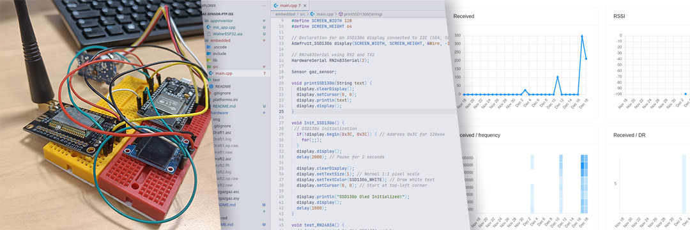
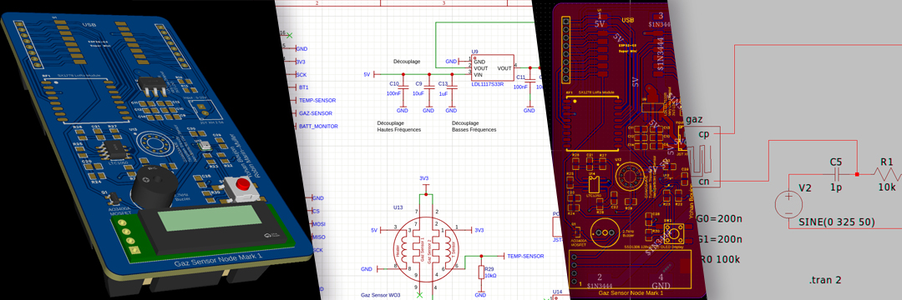
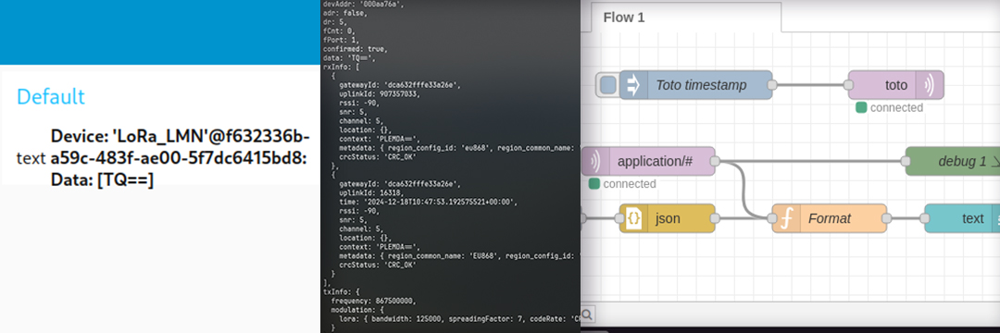
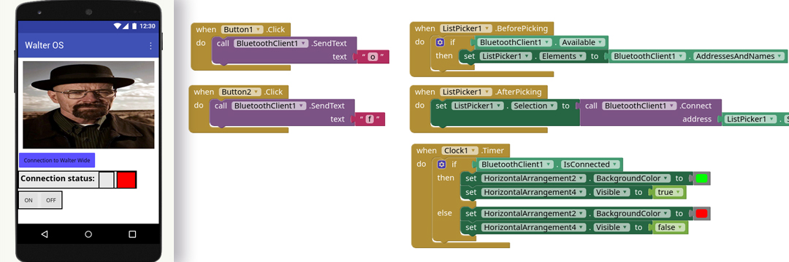

# UF Smart Devices

## Embedded

[Full Software design here](hardware)

We made a breadboard using various components like a *LoRa UART* [RN2483A](https://ww1.microchip.com/downloads/aemDocuments/documents/OTH/ProductDocuments/DataSheets/RN2483-Low-Power-Long-Range-LoRa-Technology-Transceiver-Module-DS50002346F.pdf), an [SSD1306](https://cdn-shop.adafruit.com/datasheets/SSD1306.pdf) I2C Screen and a [Gaz Sensor MQ5](https://wiki.seeedstudio.com/Grove-Gas_Sensor-MQ5/) from Seeed Studio. The goal would be to communicate using the LoRa chip to [ChirpStack](https://www.chirpstack.io/) by sending the sensor data directly to the gateway. We decided to use an ESP32 for this project, because it has a wide variety of pins that can be dynamic allocated on each gpio. Plus, espidf is a framework we are familiar with.

## Hardware

[Full LTSpice simulation and EasyEDA design here](hardware)

**Amplifier Design**

Gas sensor Characteristics:
The gas sensor has an impedance of several gigaohms, requiring signal amplification. But amplification increases signal noise as well, hence the conditioning circuit needs several filters to improve signal quality:

- Filter for the high-frequency noise.
- Filter for the 50Hz outlet noise.
- Filter for the ADC sampling noise.

When designing the signal conditioning circuit two types of amplifiers were considered: a standard low-cost amplifier and a costly very low offset amplifier (LT1050).

We performed simulations on both and found that the LTC1050, better suited our application (as expected) because a high offset could significantly affect the accuracy of the gas sensor

*Image: LTSpice Simulation of the circuit comparing the two OpAmps*

Filters Specifications:
- First Filter: Cutoff frequency at 16 Hz.
- Second Filter: Cutoff frequency at 1.5 Hz.
- Third Filter: Cutoff frequency at 1.6 kHz.

*Image: LTSpice Schematic of the cirtuit with the 3 filters outlined in blue*

Gas sensor model LTSpice simulations:
In order to simulate the entire signal conditioning circuit, we needed an electrical model of the gas sensor, described as follow:

*Image: Gas sensor electrical model schematic*

*Image: LTSpice Simulation of the gas sensor model without 50Hz filtering*

*Image: LTSpice Simulation of the gas sensor model with 50Hz filtering*

Based on the above-cited images we can clearly see why the filters (and particularly the 50Hz filter) are useful.

The goal in this part is to create a fully working PCB with everything we designed so far. Our own gaz sensor will be used. The first step would be to emulate on **LTSpice** the behavior of such a sensor. With this we can then design a board with the correct schematic on **EasyEDA**.

**Specifications**
As we were experienced with PCB design, we decided to directly dive into making the hardware based on what features we wanted:

- ESP32 based system (as we were at ease with the esp-idf framework)
- Gas sensor and conditioning circuitry
- SX1278 LoRa Module as we extensively used it in our innovative project
- LDL117 low dropout LDO to power the system efficiently on a single cell 3.7V LiPo battery
- A 2.7kHz buzzer to alarm users if gas levels are above a certain threashold
- The same SSD1306 I2C Oled Display that we used during the prototyping phase in order to diplay information to users locally
- A 12650 standard Li-Ion battery holder
- A button for easy mode switching and styreamlined user experience
- Bonus: BME MEMS Humidity sensor to provide additional metrics to the users.

*Image: Complete Schematic with all the Features Listed Above*

To facilitate and accelerate schematic design, we chose components that we were already familiar with from past projects. This enabled us to skip some prototyping steps.

We also considered the assembly process during component selection, particularly focusing on component package types to ease the soldering process.

**Routing the PCB**
- Ground and vcc plane
- Dynamic track width to handle different currents
- Thoughtfull component placement for easy soldering

*Image: From Left to Right: Top Plane, Bottom Plane and Focus on Dynamic Route Width*

**PCB Manufacturing**

We manufactured the PCB using JLCPCB as we am very familiar with the platform (from personnal and semester project). After two weeks we received the PCB and all the electronic components.

*Image: Manufactured PCBs*

*Image: Electronic Components*

Due to lack of time, we couldn’t assemble the PCB during the project time. However, we plan to complete the assembly in our personal time because it was a very interesting project.

## Node Red

[Full Node-Red setup here](node-red)

We would need to create a node-red flow to actually gather the data and show it on a dashboard. To do this we would have to connect using a MQTT Broker, Chirpstack has the ability to resend, via a given topic the data gathered by the device.

## App Inventor

Using the [AppInventor](https://ai2.appinventor.mit.edu/) we have designed a mobile application that can directly communicate with a bluetooth receiver and power on a LED. You can see the application from the files as well as the source file for the embedded part.
