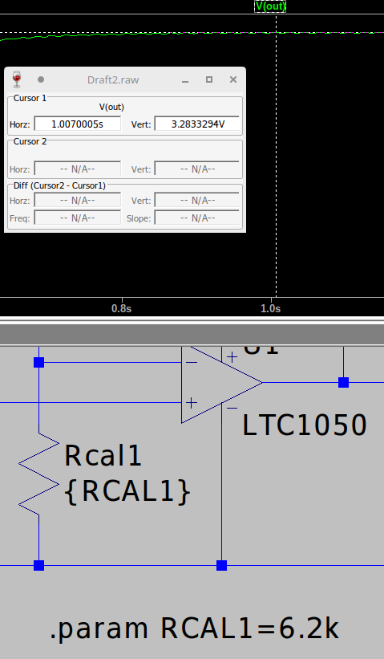

# Hardware

## LTSpice Simulation

Impédence du capteur de gaz : plusieurs gigaohms -> il faut donc amplifier le signal.

En amplifiant on amplifie aussie le bruit ! Il faut donc filtrer :
1. Filtrer le bruit hf de mesure
2. Fitlrer le bruit 50Hz
3. Filtrer l'échantillonnage de l'ADC

*Ampli normal avec gros offset*

*Ampli LT1050 très faible offset*

*Schéma ampli + filtres (en bleu)*

*Fréquence de coupure du premier filtre : 16Hz*

*Fréquence de coupure du deuxième filtre : 1.5Hz*

*Fréquenc de coupure du troisième filtre : 1.6kHz*

 
Atténuation à :
- 50Hz : 40db
- Fréquence de Shannon Nyquist (2fmax adc 15kHz) : 108dB

### Simulation avec modèle du capteur de gaz 

V = RI <=> I = 1/R V <=> I = V * G (Conductance en Siemens)

Modèle du capteur de gaz : I=V(cp,cn)*(10n+(v(gc,gn)*10n))

t=0: V(cp,cn)=0 I=V(cp,cn)*(10nS)

Si t>>1: V(gc,gn)=1 I=V(cp,cn)*(10nS+10mS)

tau=R0*C0

*Buit 50Hz atténué*

*Bruit 50Hz non atténué*

### Calcul de la résistance totale du schéma :

On est a basse fréquence donc les capacités sont analogues à des circuits ouverts, on a alors une succéssion de ponts diviseurs :

Rsortie = (1+R3/R)*R1*Vcc/Vadc - R1 - R5

On peut brancher un potentiomètre numérique pour faire varier l'amplification et éviter de saturer dynamiquement.

### Calculating $R_{cal1}$ to the best settings possible

By modifying the $R_{cal1}$ resistor we can see that the maximum output voltage can go up to $5V$. The goal would be to modify this resistor value to have a maximum output of around $3.3V$:
#### Calculate $a$
$$a=\frac{\Delta{y}}{\Delta{x}}=\frac{y_2-y_1}{x_2-x_1}$$
$$AN: a=\frac{10k-1k}{2.1-4.94}$$
$$AN: a=-3170$$
#### Calculate $b$
$$y=-3170x+b$$
$$1000=-3170(4.94)+b$$
$$b=3170(4.94)+1000$$
$$b=16659$$
#### Numerical Application
$$y=-3170x+16659$$
We can now calculate the resistor $R_{cal1}$ to have $3.3V$ in maximum output with the previous formula, we find:
$$-3.17\times{10^3\times{3.3V}}+16.7\times{10^3}=6.2k\Omega$$

> Has we can see with the LTSpice simulation, we have the correct maximum voltage, it does not go further than $3.29V$ which is exactly what we wanted.

## Electronic CAD with EasyEDA
